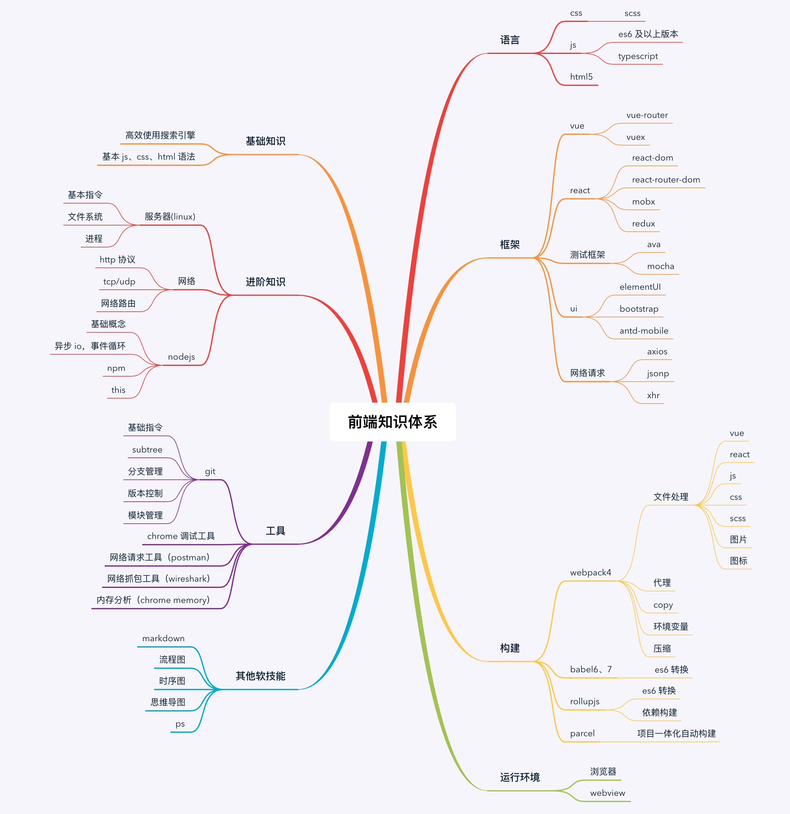

# 2019 前端知识体系

下图是我从目前公司实际项目中总结出来的，区别于网上很多大而全的总结内容，虽滴水不漏，但是要想穷尽，难度极大。因此本文将从实际应用出发，带领大家快速进入现代前端领域
（我并没有使用、了解过 **Angular**，因此对此框架的一切评论都不在本文讨论范围）。

我从06年开始编程，14年毕业后写了两年 **java**，16年接触 **node**，也是从此开始进入前端的行列，在公司的驱使下一步步成为一名全栈开发。
时间不长，在我有限的经历中对前后端都有一定的认知：前后端不同的侧重点以及基本功（全栈的部分将在后续文章详细介绍）。

此图我也曾用在公司内部培训中，因为它可能并不是最全面的，但是经历过商业系统的洗礼（一切商业行为都是以利益最大化为导向：开源节流），它应该是那把最锋利的手术刀帮你插入前端。

